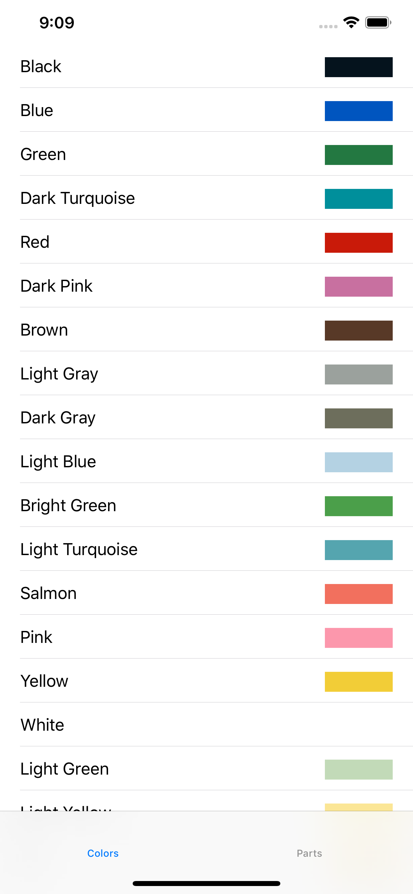
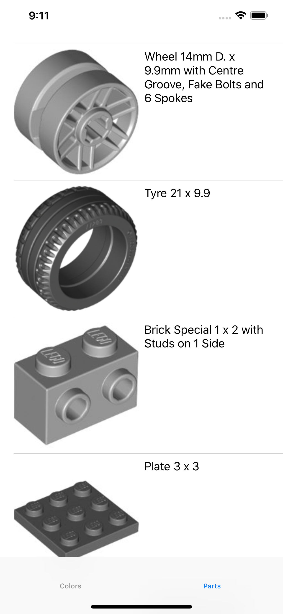

  

  
  

#  My LEGO Collection

> ⚠️ Work in progress

## Ultimate goal

An iPhone and iPad app where you can browse LEGO sets and parts and manage sets and parts lists, just like [Rebrickable](https://rebrickable.com/) but with more features, and really fast thanks to an embedded SQLite database.

The database is seeded with data from Rebrickable and other sources, and maintained up to date with regular over-the-air updates.

A built-in, super easy to use 3D designer lets you explore and manipulate parts and create virtual LEGO builds.

## Current situation

A simple app where you can browse a list of LEGO part colors, using an embedded database seeded with data from Rebrickable.

A command line tool retrieves data from the [Rebrickable API](https://rebrickable.com/api/v3/docs/) and creates a SQLite database file that then gets embedded into the app as a bundle resource.

## Current objective

Add parts. The list should show the picture of the part provided by rebrickable.

## TODO

- [x] update [specs for the command line tool](specs/cli.md)
- [x] update [specs for the app](specs/app.md)
- [ ] update the command line tool
- [ ] update the app

## Design guidelines

Features should be kept to a strict minimum, just enough to explore what works and what does not.
User interface and experience should be just enough to make things usable.
Ease of use and visual appeal should not be of any consideration.

Technical design and quality code should be the top priority.
All code should be well documented and contracts clearly communicated.
Code should be as simple as possible and focused on implementing the actual and current features and nothing more.
Abstractions and indirections should be kept to a minimum.
Refactoring should happen as often as needed to keep things well designed and reasonably maintainable.
Performance and resource optimization is off topic.

Error handling is not important and efforts should concentrate on the success scenarios.
Error handling code should only exist to :
- protect the integrity of the system or its outputs
- reveal errors when they occur instead of when they start breaking things
Crashing the app is ok and should be the preferred way to handle errors.

## Design notes

### Data models and the database

There are three distinct data models:

#### The Rebrickable data model

Used to work with data retrieved from the Rebrickable web service. These models map exactly
to the data representation used by the web service.

#### The database data model

Used to store data in the database. These models should not be tied to the Rebrickable
webservice, as in the future the database may store data from other sources. 

#### The app data model

Used in the app to manipulate data. These models provide more strict typing.
